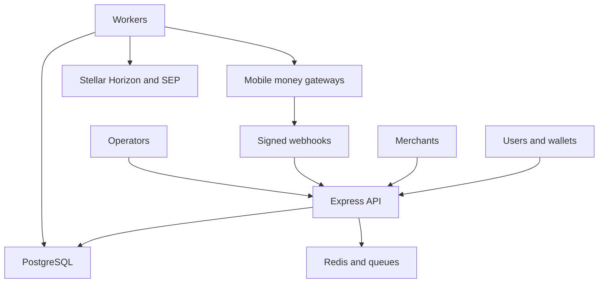

# Security and threat model

## Scope and assumptions

This model covers the Express API (`src/index.ts`, `src/routes/`), provider adapters (`src/providers/`, `src/services/mobilemoney/`), Stellar/SEP integrations (`src/stellar/`), PostgreSQL/Redis, workers, and React/CLI clients. The deployment is assumed internet-facing, with authenticated user/admin routes and public SEP discovery/rate routes. Stellar consensus, wallet internals, and third-party gateway implementation are out of scope.

## System model and trust boundaries

The API accepts user, merchant, webhook, and admin requests; persists transaction and sensitive metadata; workers call mobile-money gateways and Stellar Horizon; provider callbacks update transaction state. Authentication, API-key checks, signature verification, rate limiting, and validation exist in middleware and adapters, but every new callback must be checked against them.

## Assets and security objectives

| Asset | Risk | Objective |
|---|---|---|
| User PII/KYC documents | Identity and regulatory harm | Confidentiality |
| Provider/API keys and signing secrets | Unauthorized payouts and data access | Confidentiality, integrity |
| Transaction state and balances | Financial loss from forged transitions | Integrity, availability |
| Webhook idempotency and audit records | Replay prevention and investigations | Integrity |
| Database, Redis, and queues | Service outage or delayed settlement | Availability |

## STRIDE threats and mitigations

| ID | STRIDE | Abuse path | Impact | Likelihood | Priority | Mitigation and detection |
|---|---|---|---|---|---|---|
| TM-001 | Spoofing/Tampering | Replay or forge provider webhook -> match reference -> transition transaction | Unauthorized payout or false completion | Medium | High | Verify signatures, timestamps/nonces, and idempotency before mutation; alert on duplicate signatures. Evidence: `src/providers/*/*Webhook.ts`. |
| TM-002 | Tampering | Bypass API-key/JWT/RBAC -> read or alter another merchant's transactions | PII disclosure or financial loss | Medium | High | Keep auth on admin/merchant routes, enforce ownership in queries, and test negative authorization. Evidence: `src/auth/`, `src/routes/admin.ts`. |
| TM-003 | Information disclosure | Abuse verbose errors, logs, exports, or KYC uploads | PII/KYC exposure | Medium | High | Redact tokens/PII, encrypt storage/backups, constrain exports, and alert on bulk downloads. Evidence: `src/utils/redact.ts`, `src/routes/export.ts`. |
| TM-004 | Denial of service | Flood rates, callbacks, or transaction creation -> exhaust providers/DB/queues | Delayed or unavailable payments | High | High | Per-route limits, queue backpressure, circuit breakers, and timeout budgets; monitor 429s and queue depth. Evidence: `src/middleware/rateLimiter.ts`, `src/services/circuitBreaker.ts`. |
| TM-005 | Elevation | Abuse admin endpoint or weak key -> refunds, vault, or reconciliation actions | Irreversible financial/admin actions | Low/Medium | High | Strong admin auth, scoped keys, MFA/2FA, maker-checker, immutable audit logs. Evidence: `src/routes/admin.ts`, `src/routes/makerChecker.ts`. |
| TM-006 | Repudiation | Alter or omit transaction/audit events -> deny settlement action | Loss of forensic evidence | Low | Medium | Append-only audit events with actor/request IDs, protected retention, and provider/Stellar reconciliation. Evidence: `src/utils/correlationIdInterceptor.ts`. |
| TM-007 | Spoofing/Tampering | MITM or wrong provider/Horizon URL -> leak credentials or accept false status | Credential theft or wrong settlement | Low | High | Enforce HTTPS, allowlist endpoints, rotate credentials, and use HSM/KMS for signing keys. Evidence: `docs/SECRETS_MANAGEMENT.md`, `src/config/`. |

## Key management and HSM roadmap

Short term: keep secrets out of source and `.env`, use the configured secret manager, least-privilege credentials, key rotation, and log scrubbing. Medium term: move Stellar signing and vault keys behind KMS/HSM-backed non-exportable keys, dual control for transfers, rotation metadata, and audit alerts. Test key loss, rotation, and provider credential revocation in staging.

## Review focus

Review `src/index.ts`, `src/auth/`, `src/routes/admin.ts`, `src/providers/`, `src/stellar/`, `src/services/webhook*`, `src/services/circuitBreaker.ts`, `src/routes/sep38.ts`, `src/routes/health.ts`, and `src/workers/`. Priorities depend on callback signature verification and whether admins have MFA/network restrictions.
